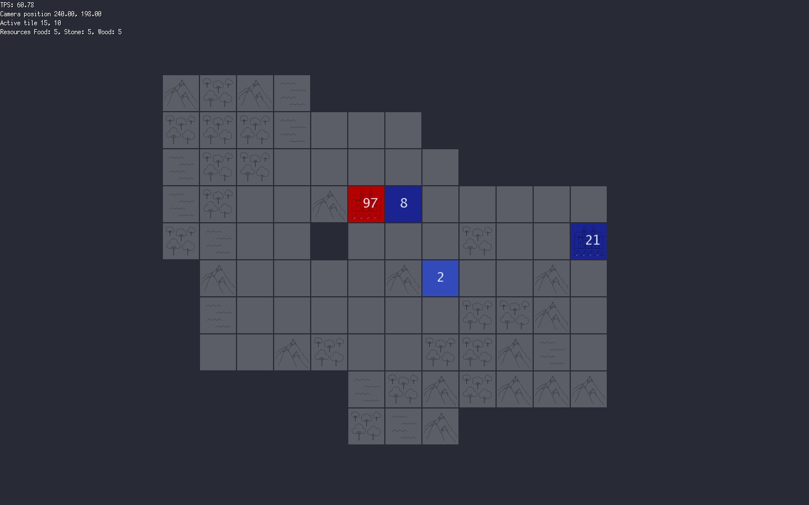

# Rook

**Rook** is a multiplayer Risk-styled game built using the Cosmos SDK, Tendermint and Ebiten

*This is still a work in progress. Not all features, notable the online part, is available*

## Getting Started

To start a game:

1. Clone the repository - `git clone https://github.com/cmwaters/rook`

2. Go to the cmd/rook directory - `cd rook/cmd/rook`

3. Build the binary - `go build`

4. Run the binary to start the game - `./rook`

## Game Rules

Each game starts with some resources and a capital. The objective is to capture other capitals whilst protecting your own. To capture an opponents capital or any settlement for that matter, the conflict mechanics are simple: whichever faction has the most population on the same tile wins. The map has 4 types of landscapes, there is 3 types of resources and 7 types of settlements each with possessing their own set of characteristics:

### Landscapes

1. Plains: Empty tiles are considered plains and are used for building all settlements except lumbermills. Populations can move freely through plains.

2. Forests: can be used to build lumbermills to receive wood. Populations can also more freely through forests.

3. Mountains: are impassable terrain. Quarrys can be built on plains adjacent to mountains to receive stone.

4. Lakes: are also impassable terrain and serve no other current purpose.

### Resources

There are three resources: Food, Stone and Wood which are used to build settlements

### Population

Towns, Cities and Capitals produce population. These can be moved around from tile to tile and have one line of sight around them. Use the arrow keys to move the population from tile to tile. One population is automatically left behind to occupy a settlement.

### Settlements

1. Capital: Has the same properties as a city with the exception that capturing all of an opponents capitals will result in occupying all settlements and populations

2. City: A city is built on top of an existing town. It produces two population per turn. Press `c` to build

3. Farm: Must be built on plains and produces food. Press `f` to build

4. Lumbermill: Must be built in a forest and produces wood. Press `l` to build

5. Quarry: Must be adjacent to mountains and produces stone. Press `q` to build

6. Rook: Has three line of sight (instead of one). Can be placed next to a town, city or capital to stop them from producing population.

7. Town: produces one population per turn.

These are just the standard rules, however, a config file can be adjusted to changes many of the properties of the game allowing for much greater flexibility in the strategies that one needs to adopt.

### Navigation

To navigate around the map either use the scroll wheel (and the `shift` button to change the axis of scrolling), the trackpad, or simply the `w`, `a`, `s`, `d` keys to jump from tile to tile.